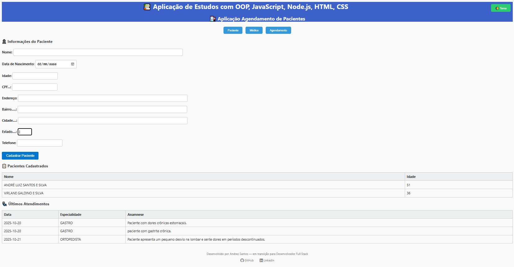
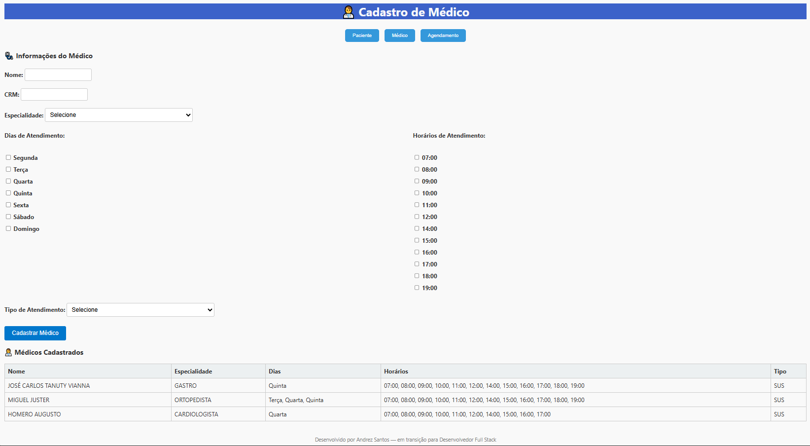
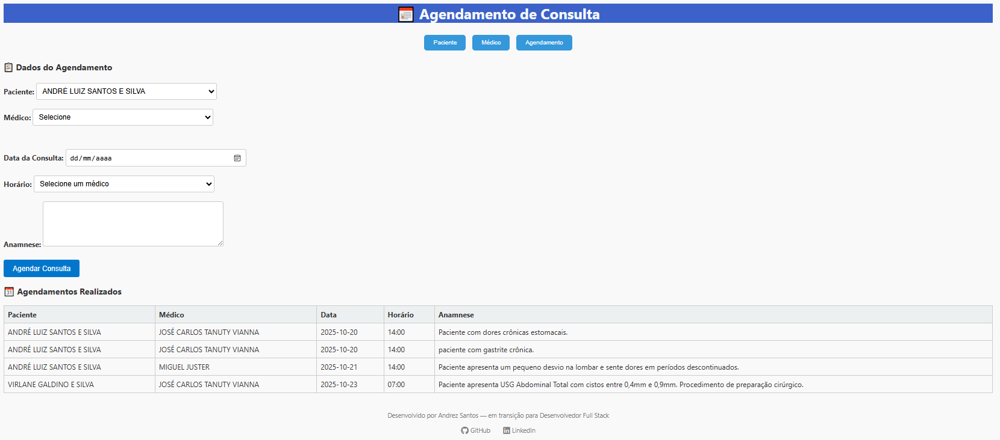

# Cadastro de Pacientes com Orientação a Objetos

Este projeto simula o cadastro e agendamento de pacientes utilizando os conceitos de orientação a objetos em JavaScript:

## Funcionalidades
- Cadastro de múltiplos pacientes
- Agendamento de consultas
- Filtro por especialidade
- Interface HTML simples

## Tecnologias
- JavaScript (ES6)
- HTML5
- VS Code
- Node.js

## Como executar

1. Instale o Node.js
2. Clone o repositório
3. Execute com: `node paciente.js`
4. Para visualizar a interface, abra `cadastro-paciente.html` no navegador

## Autor | Sobre

Andrez Santos — desenvolvedor da década de 90 com Clipper, migrando em 1996 para Visual Basic 6 for Windows... Afastei da área em 2008 para atuar na administração orçamentária da construção. Nesse período criei algumas automações em VBA para Excel, e implantei sistemas de terceiros. Em 2020 tive um encontro com as metodologias Ágeis para aplicação também na área administrativa e financeira. Porém 2021 usei massivamente Google Sheet com AppScript, para uma empresa ao qual prestei serviços, nesse momento me motivou para estudar desenvolvimento web. Em 2024 fui contratado para secretaria de saúde para viabilizar soluções de fluxos de atendimentos e implantações de Sistemas do SUS - Sistema Únicio de Saúde. Desenvolvi automação para as unidades de Saúde  2025, com HTML e Appscript, uma solução gratuita e que resolveu 100% na velocidade e classificação de atendimentos prioritários. Neste mesmo ano iniciei uma formação FullStack em HTML, CSS, Javascript, Node.JS e React, ainda estou aprendendo a converter a semântica de codificação do passado às novas tecnologias. E decidi nesse novo desafio profissional, aos meus 51 anos, fazer 100% a minha transição de carreira para desenvolvedor Full Stack. 

===

## Sobre esse projeto de estudo e aplicação de OOP

# Sistema de Agendamento de Consultas

Este projeto foi desenvolvido como parte de aprimoramento para as práticas e aperfeiçoamento de OOP - Programação Orientada a Objetos(Classes, objeto, encapsulamento, Herança, poliformismo e abstração), com o objetivo de demonstrar conhecimentos em **HTML, CSS, JavaScript**, **orientação a objetos**, **boas práticas de UX/UI** e **estruturação de aplicações web**.

---


📌 Observações: 

Este projeto é uma simulação acadêmica e não possui banco de dados, mas usando tecnologia localStorage. 

---

## 🎯 Objetivo

Simular um sistema de agendamento de consultas médicas com foco em:

- Cadastro de pacientes e médicos
- Agendamento de consultas com anamnese
- Separação de responsabilidades por tela (HTML modular)
- Experiência do usuário fluida e intuitiva
- Aplicação de boas práticas de front-end e lógica de programação

NOTAS: "O objetivo não é de esgotar as funcionalidades de um sistema de atendimento clinico."

---

## 🧰 Tecnologias Utilizadas

- HTML5
- CSS3
- JavaScript (ES6+)
- Font Awesome (ícones)
- Estrutura modular com múltiplos arquivos

---

## 🧠 Funcionalidades

### 👤 Cadastro de Paciente
- Nome, data de nascimento (com cálculo automático da idade), CPF, endereço, telefone
- Lista de pacientes cadastrados
- Histórico de últimos atendimentos

### 👨‍⚕️ Cadastro de Médico
- Nome, CRM, especialidade, dias e horários de atendimento
- Tipo de atendimento (Particular ou SUS)
- Lista de médicos cadastrados

### 📅 Agendamento
- Seleção de paciente e médico
- Data, horário e anamnese
- Tabela com agendamentos realizados

---

## 🧭 Navegação

O sistema é dividido em três telas principais:

- `cadastro-paciente.html`
- `cadastro-medico.html`
- `agendamento.html`

Cada uma possui navegação entre si via botões no topo da página.

/projeto-agendamento/

├── cadastro-paciente.html   → Tela de cadastro de paciente
├── cadastro-medico.html     → Tela de cadastro de médico
├── agendamento.html         → Tela de agendamento
├── style.css                → Estilo global
├── js/
│   ├── paciente.js
│   ├── medico.js
│   ├── agendamento.js
│   └── → Funções comuns (ex: calcular idade)


---

## 📸 Capturas de Tela




---

## 🚀 Como Executar

1. Clone o repositório:
   ```bash
   git clone https://github.com/AndrezSantos/sistema-agendamento.git
